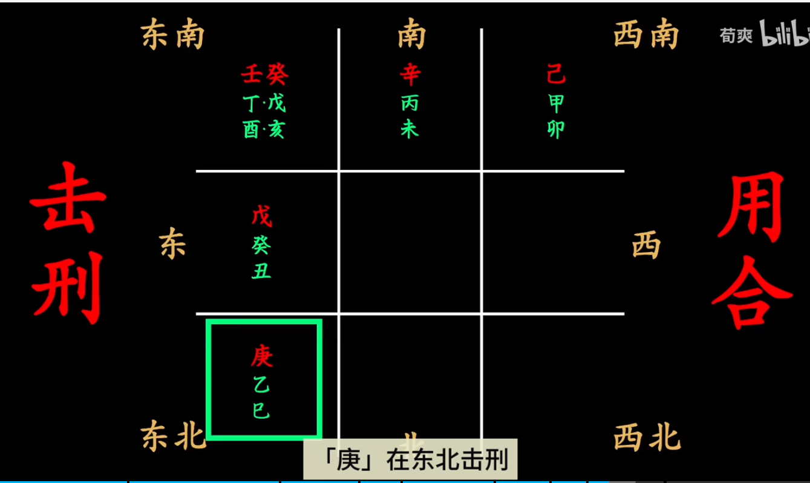
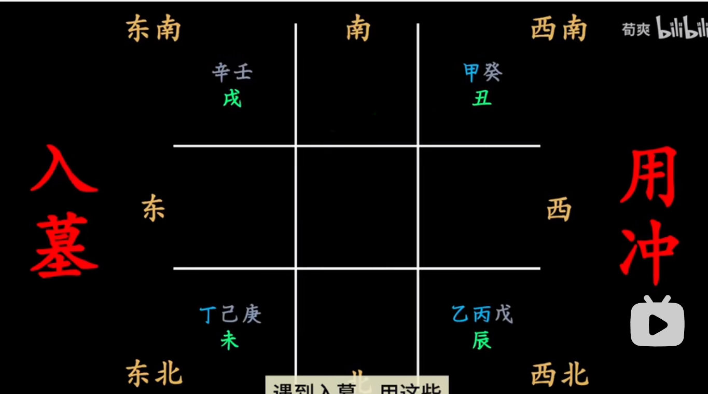
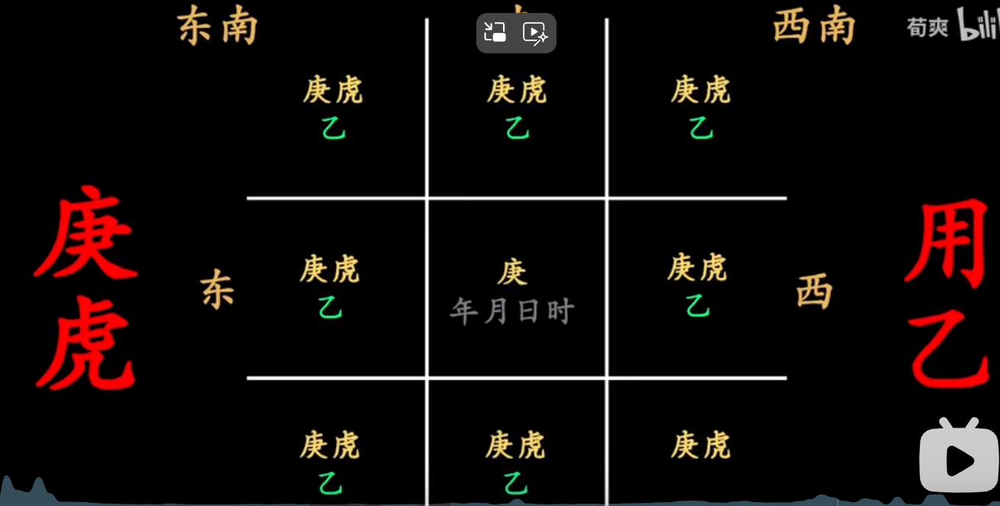
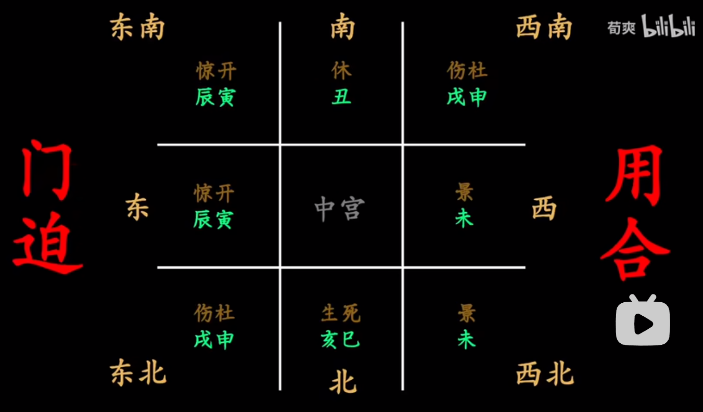
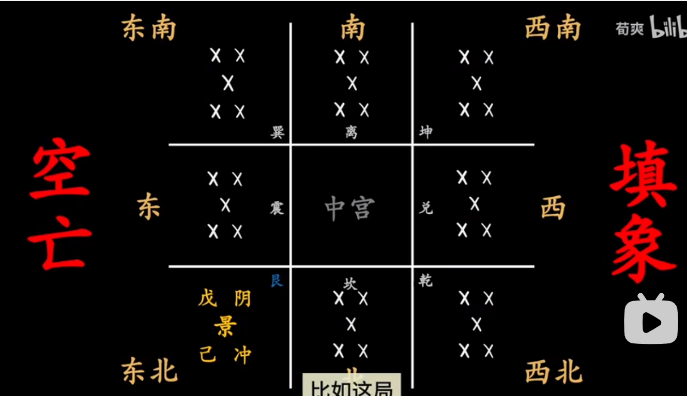

- [六害](#orgc7f6160)
  - [宫](#org89965bf)
  - [干](#org36e5352)
  - [门](#orgccf67d7)
  - [神](#org6bd3b52)
- [八门化气阵](#org5410830)
  - [布阵前先灭象](#orgb43edde)
  - [保护天干——布阵底线目标](#orgfb2ab48)
  - [布阵方法](#orga297c04)
    - [击刑用合](#orgbdff7b6)
    - [入墓用冲](#orgd7c75da)
    - [庚虎用乙](#orgb6d41a2)
    - [门迫用合](#orge8af4c8)
    - [空亡填象](#orga0d9fb7)

[奇门遁甲](奇门遁甲-20240917153228.md)

# 六害

奇门遁甲的化气核心在于布阵化解压制六害。六害之中【刑墓庚】尤为危险，而击刑尤以​**六仪击刑**​最为严重，入墓尤以​**三奇入墓**​最为严重。而甲作为统帅，为金庚所克，故​**庚**​作为一干独立成灾。

## 宫

-   空亡：虚假不实，为人所欺骗

## 干

-   击刑：争执损耗
-   入墓：沉溺迷失
-   庚：凶祸阻隔

## 门

-   门迫：压力胁迫

## 神

-   白虎：快速突然危险

# 八门化气阵

## 布阵前先灭象

-   刑：可移可送可扔
-   墓：只可以移，不可送弃
-   庚：取决于行业，高风险、武力行业不可灭

## 保护天干——布阵底线目标

-   日时：起局时的日干时干。通常日干表示内在实质，时干表示外在表象。
-   生年：局中人的八字年干。例如家中布阵，家人的年干。
-   意象：你所在意事物的对应的天干。
    -   财富戊，暴力庚，权威甲，突破辛，表现丙，情欲癸。
-   符使：值符，值使。符是是话语权，使是用武之地。

## 布阵方法

### 击刑用合

### 入墓用冲

### 庚虎用乙

### 门迫用合

### 空亡填象

