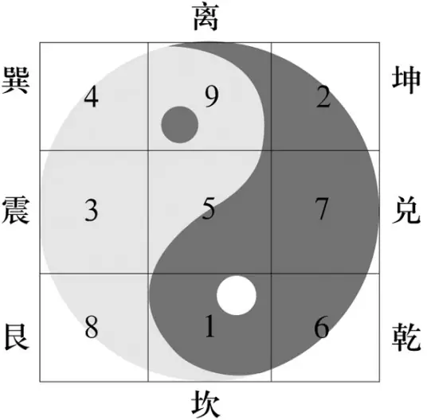
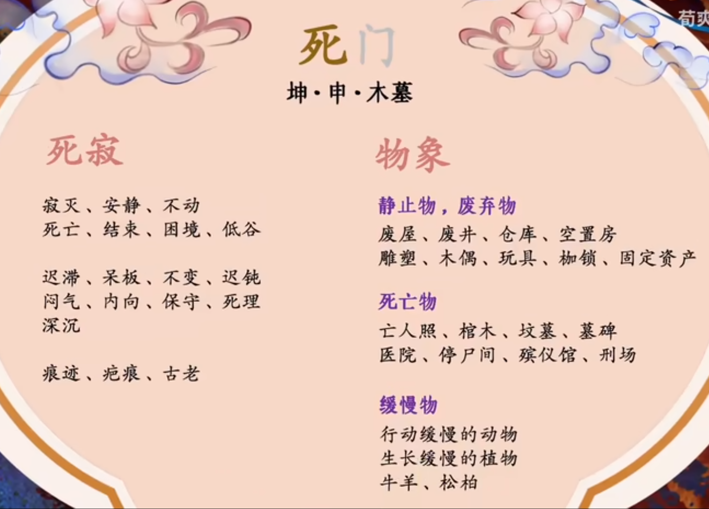

- [九宫](#org61838c8)
- [干](#orgac1cb04)
  - [木](#orgcf80928)
    - [甲——领导，挺拔](#org7b89740)
    - [乙——柔弱依附](#org0d4dc16)
  - [火](#org04e5516)
    - [丙——表现，放射](#org3104b9d)
    - [丁——闪烁，亮眼](#orgf7650d2)
  - [土](#org83a0c35)
    - [戊——收容，积聚](#orgee03ec1)
    - [己——阴险，谋划](#org9821da1)
  - [金](#org9370472)
    - [庚——凶猛，敌对](#org7b44798)
    - [辛——变化，革新](#org87ffc7f)
  - [水](#org390d7b5)
    - [壬——流动放纵](#org4f3bce5)
    - [癸——沉迷浑浊](#orgaf46056)
- [门](#org7b09019)
  - [休门](#org81d3a29)
  - [生门](#org02d1dc3)
  - [伤门](#orgd2ba16e)
  - [杜门](#org9511b23)
  - [景门](#org2a403fd)
  - [死门](#org80afe04)
  - [惊门](#org2a3a531)
  - [开门](#orgc417431)
- [星](#orgc407694)
  - [天蓬](#orgb634471)
  - [天壬](#org13c5406)
  - [天冲](#org8f7458a)
  - [天辅](#orgbe11e80)
  - [天英](#org62c5a59)
  - [天内](#orgf19c27d)
  - [天柱](#org3c7165e)
  - [天心](#orgdc23abe)
- [神](#org7d05c1c)
  - [直符](#orgcf88fa7)
  - [螣蛇](#org26485e1)
  - [太阴](#org7a63704)
  - [六合](#orgb2f4ee4)
  - [白虎](#org7a17e6c)
  - [玄武](#org030a71d)
  - [九地](#orgf8a8414)

# 九宫

根据洛书来的九个格子，标志方位 

以上为南，以下为北。中宫不动，后天八卦环绕中宫。

 这是后天八卦，卦象此图，方位和顺序按照九宫来。

# 干

天干地支对照属性表如下： 

是天干，九宫之中有一个天盘干，一个地盘干，以天盘干为主。

## 木

### 甲——领导，挺拔

-   权威，名贵，一流
-   挺拔，上进，奋斗
-   直爽，高傲
-   有壳，保护
-   **亮绿，硬植**

### 乙——柔弱依附

-   柔弱依附，曲折委婉，骑墙
-   艺术，中医
-   草药，风
-   美女，妻子
-   沟通
-   **暗绿，软植**

## 火

### 丙——表现，放射

-   热烈急躁，虚荣雄壮
-   希望，光明，权柄，争斗，动乱
-   能源，圆形
-   宣传
-   **大红，光源**

### 丁——闪烁，亮眼

-   突出亮眼，闪烁尖锐
-   奇迹，意义
-   文字，目光，文书，票证
-   小三，玉女，阴茎
-   信息技术
-   **暗红，尖锐**

## 土

### 戊——收容，积聚

-   包容稳重，宽厚不变
-   资本，容器，资产
-   钱，土地，房子，大肉
-   **棕色，容器**

### 己——阴险，谋划

-   阴险弯曲
-   谋划，欲望，邪念
-   低洼，陷阱，坑
-   厕所，排泄，垃圾
-   小肉，嘴
-   **暗棕，弯曲**

## 金

### 庚——凶猛，敌对

-   凶猛霸道，武断肃杀，坚硬
-   阻隔，打斗
-   金属，骨头
-   武器
-   癌症
-   **黄白，金属**

### 辛——变化，革新

-   激烈创意，问题改革
-   变化，要害
-   首饰，铜钱，金玉
-   颗粒
-   **金黄，小金属**

## 水

### 壬——流动放纵

-   聪明风流，无主迷茫，纵欲飘荡
-   逻辑，运输
-   旅行
-   动脉
-   **亮蓝，净水**

### 癸——沉迷浑浊

-   多情迷醉，多愁浑浊，多欲沉迷
-   饮料（酒，茶，汤），污水
-   鞋，静脉
-   鬼
-   **暗蓝，污水**

## 天干五合
上下相合，如在盘中不见一干，就去找相合的天干。但是甲为特例，找不到甲就去找值符。
甲乙丙丁戊
己庚辛壬癸

# 门

八门原宫和五行如下： 

## 休门

## 生门

## 伤门

## 杜门

## 景门

## 死门

## 惊门

## 开门

# 星

此乃北斗九星，在上古北斗有九颗星(如今的七颗加上天内天冲两颗辅星)，其中天禽位居中宫，实际轮转的只有八颗

## 天蓬

## 天壬

## 天冲

## 天辅

## 天英

## 天内

## 天柱

## 天心

# 神

八神原始宫位如下 

## 直符

 奇门遁甲之中甲隐藏了，所以由直符掌管

## 螣蛇

## 太阴

## 六合

## 白虎

## 玄武

## 九地

