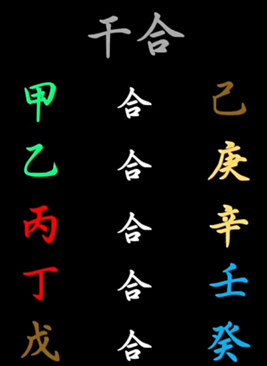
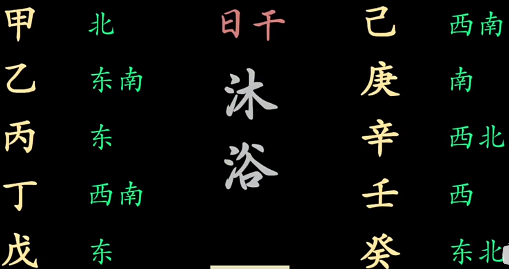
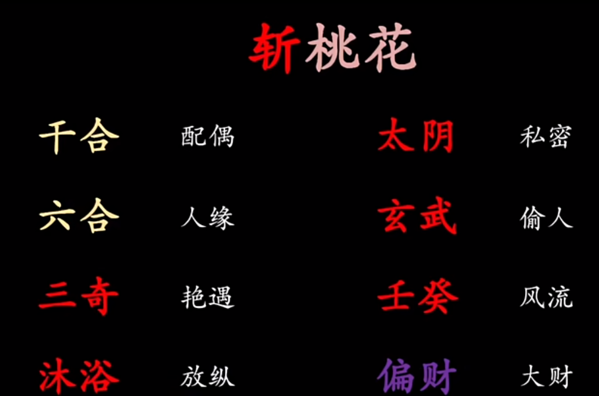

- [姻缘爱欲](#orge3270f1)
  - [正缘](#orgc7f0b32)
  - [桃花](#orgdf5d880)
    - [三奇](#orgabb1ce4)
    - [沐浴](#org18c8401)
  - [爱欲横流](#org802cde2)
    - [丁癸之术](#org5bd16ba)
    - [伤门](#orgb047325)
    - [天蓬](#org064a3b4)
  - [斩桃花](#org43bf8ff)

# 姻缘爱欲

## 正缘

求正缘，要看​**干合**​——日干所合。日干和日干所合的位置如有击刑入墓，则先必须解除。首先找出这对干合各自所在宫的意象，放在对应位置9天以后，把这一对意象一起放到不出现六灾某个方位即可。 注意，​**放到同一个方位**​表示两人直接的接触交往，而如果​**放在六合**​，就意味着借由他人介绍相亲而得。

## 桃花

### 三奇

三奇乃是一见钟情，不可自抑。

-   乙：温柔；
-   丙：热辣；
-   丁：妖艳。

若要招来三奇，即在自己日柱所在方位放上对应意象即可。

### 沐浴

日干的沐浴之处，意味着赤诚相见，鱼水之欢。因此将日干的意象放于其沐浴之位，可招此类。  沐浴之位，既是身体放纵，又是精神松懈，最易​**泄密**​。

## 爱欲横流

### 丁癸之术

男催癸，女催丁。 在丁癸所在宫放入生助的意象，如丁处放入木火，癸处放入金水。

### 伤门

将干与干合放入伤门所在处，可催生丰富奇趣。 不可久用，否则伤命。

### 天蓬

多毛之物，利于毛绒衣物，宠物猫狗。 可将毛绒物和蓝黑色放入日干宫。

## 斩桃花

前文所述桃花均为浪漫风流之事，如已经找到正缘或者已经婚配，就当恪守责任，斩断桃花。 

把红字全部送入击刑入墓之处即可压制。
