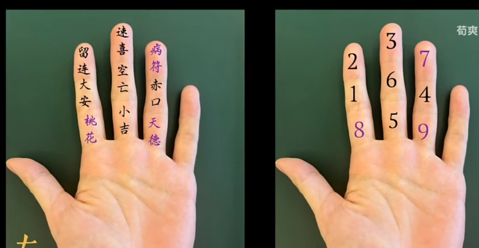

- [小六壬](#org4bf6219)
  - [掐指](#org8864e9a)
  - [卦象](#orgbb8c113)
  - [使用方法](#orgac6ea14)

# 小六壬

小六壬即所谓“掐指一算”，将在手指上布置九宫五行，作为方便法门。

## 掐指

手指顺序如下: 

九宫的布置和奇门遁甲一样，其中6、7、8对角线为土，1、2为木，3为火，5为水，4、9为金。

## 卦象

-   大安：安定，稳定，静止。三清。
-   留恋：纠缠，反复，拖延。文昌。
-   速喜：快速，变化，惊喜。雷祖。
-   赤口：伤害，争斗，凶恶。将帅。
-   小吉：起步，不多，尚可。真武。
-   空亡：失去，虚伪，幻想。玉皇。
-   病符：异常，病态，治疗。后土。
-   桃花：欲望，牵绊，爱情。城隍。
-   天德：贵人，上司，高远。紫薇。

## 使用方法

使用时可选时间、所占事笔画、事主生日等等三个数字，进行占卜，得到三个结论，三者五行关系会揭示事情的发展关系。
